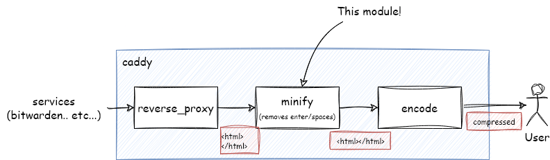

# File (html/css/js/etc..) minification module for Caddy v2

powered by [tdewolff/minify](https://github.com/tdewolff/minify) & inspired by [hacdias/caddy-v1-minify](https://github.com/hacdias/caddy-v1-minify)

## Caddy module ID
```
http.handlers.minify
```

## Support `Content-Type`s
* HTML: `text/html`
* CSS: `text/css`
* SVG: `image/svg+xml`
* JavaScript: `^(application|text)/(x-)?(java|ecma)script$`
* JSON: `[/+]json$`
* XML: `[/+]xml$`

## Performance
See https://github.com/tdewolff/minify#performance

## How to use
JSON config:
```json
{
  "handler": "minify"
}
```

or Caddyfile (Make sure to order the handler in the correct place.):

```Caddyfile
{
    order minify after encode
}
```

```
example.com {
    minify
    root ./test
    file_server     
}
```

```
example.com {
    minify
    reverse_proxy localhost:8080
}
```

## Limitations
This module doesn't minify the original responses that have already been compressed, It just skips them.
 
To work around this, you may send the `Accept-Encoding: identity` request header to the upstream to tell it not to compress the response. For example:

```caddyfile
reverse_proxy localhost:8080 {
    header_up Accept-Encoding identity
}
```
